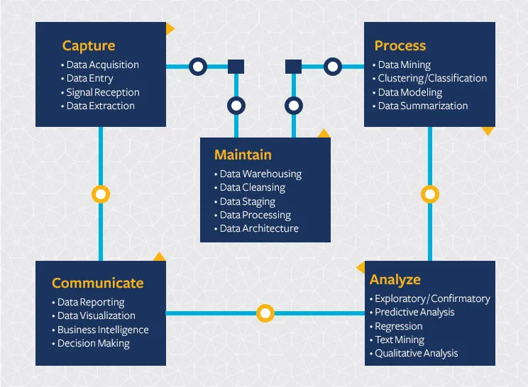
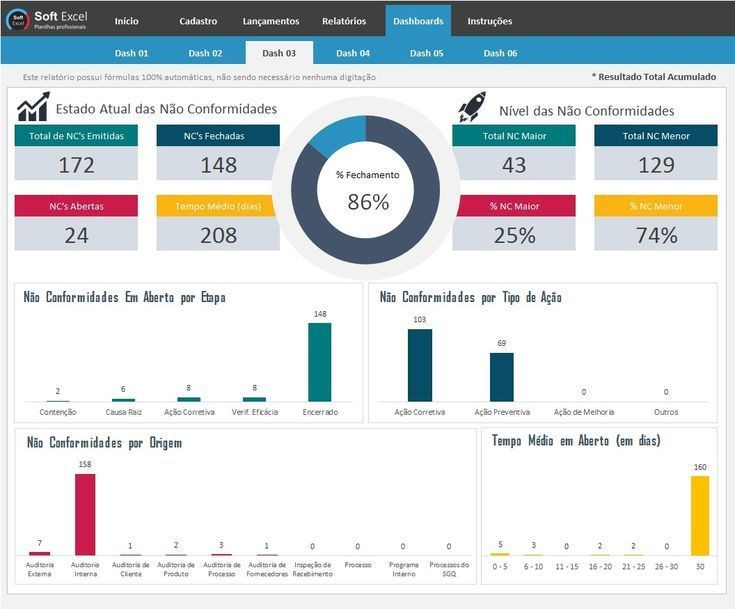
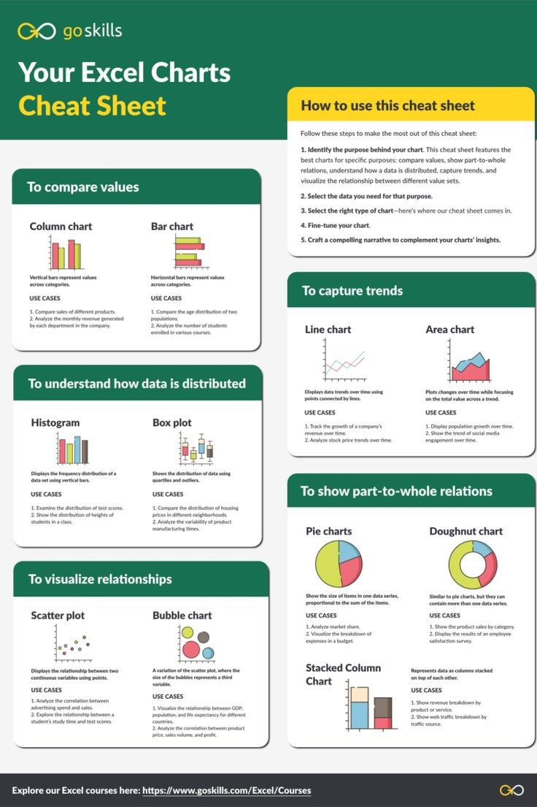
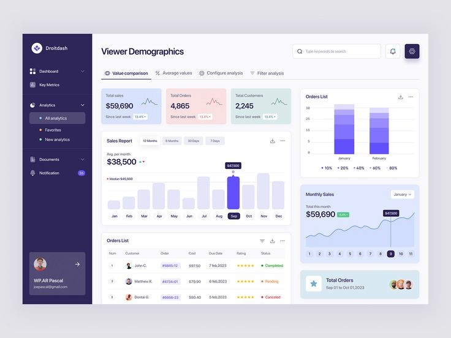
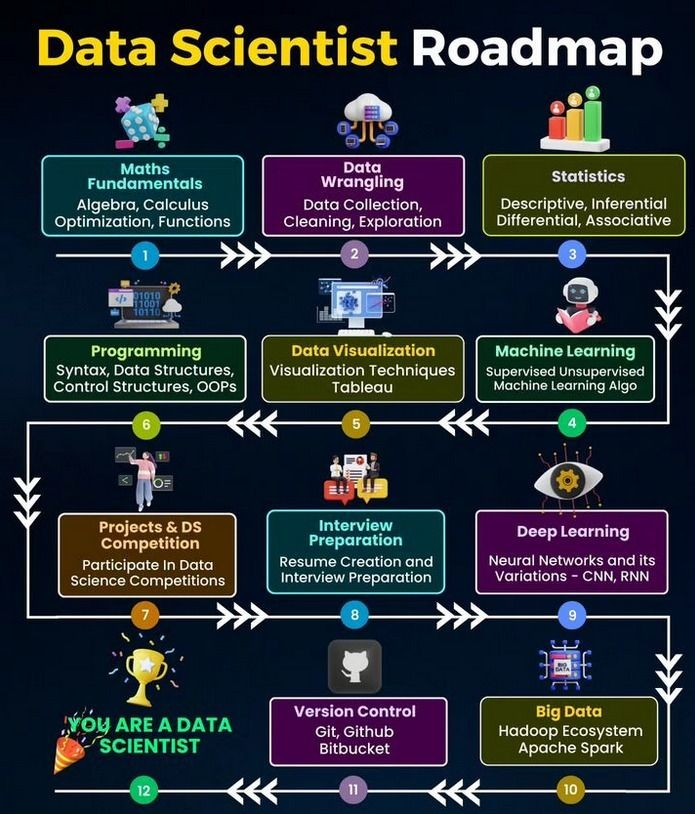

# What is Data
Data is a word we hear everywhere nowadays. In general, data is a collection of facts, information, and statistics and this can be in various forms such as numbers, text, sound, images, or any other format.

# Types of data

The data is classified into majorly four categories:

Nominal data
Ordinal data
Discrete data
Continuous data
Further, we can classify these data as follows:

**Qualitative or Categorical Data**

Qualitative data, also known as the categorical data, describes the data that fits into the categories. Qualitative data are not numerical.

Sometimes categorical data can hold numerical values (quantitative value), but those values do not have a mathematical sense. Examples of the categorical data are birthdate, favourite sport, school postcode. Here, the birthdate and school postcode hold the quantitative value, but it does not give numerical meaning.

**Nominal Data**

Nominal data is one of the types of qualitative information which helps to label the variables without providing the numerical value. Nominal data is also called the nominal scale. It cannot be ordered and measured. But sometimes, the data can be qualitative and quantitative. Examples of nominal data are letters, symbols, words, gender etc.

The nominal data are examined using the grouping method. In this method, the data are grouped into categories, and then the frequency or the percentage of the data can be calculated. These data are visually represented using the pie charts.

**Ordinal Data**

Ordinal data/variable is a type of data that follows a natural order. The significant feature of the nominal data is that the difference between the data values is not determined. This variable is mostly found in surveys, finance, economics, questionnaires, and so on.

The ordinal data is commonly represented using a bar chart. These data are investigated and interpreted through many visualisation tools. The information may be expressed using tables in which each row in the table shows the distinct category.

**Quantitative or Numerical Data**

Quantitative data is also known as numerical data which represents the numerical value (i.e., how much, how often, how many). Numerical data gives information about the quantities of a specific thing. Some examples of numerical data are height, length, size, weight, and so on. The quantitative data can be classified into two different types based on the data sets. The two different classifications of numerical data are discrete data and continuous data.

**Discrete Data**

Discrete data can take only discrete values. Discrete information contains only a finite number of possible values. Those values cannot be subdivided meaningfully. Here, things can be counted in whole numbers.

Example: Number of students in the class

**Continuous Data**

Continuous data is data that can be calculated. It has an infinite number of probable values that can be selected within a given specific range.

Example: Temperature range

## **Categories of Data**

Data can be categorized into two main parts –

**Structured Data:** 

This type of data is organized data into specific format, making it easy to search , analyze and process. Structured data is found in a relational databases that includes information like numbers, data and categories.

**Unstructured Data:** 

Unstructured data does not conform to a specific structure or format. It may include some text documents , images, videos, and other data that is not easily organized or analyzed without additional processing.

# What is Data Science
Data Science is a combination of multiple disciplines that uses statistics, data analysis, and machine learning to analyze data and to extract knowledge and insights from it.
Data science is the field of exploring, manipulating, and analyzing data, and using data to answer questions or make recommendations.

Data science is the study of data to extract meaningful insights for business. It is a multidisciplinary approach that combines principles and practices from the fields of mathematics, statistics, artificial intelligence, and computer engineering to analyze large amounts of data. This analysis helps data scientists to ask and answer questions like what happened, why it happened, what will happen, and what can be done with the results.

Data science is a multidisciplinary field that uses scientific methods, algorithms, processes, and systems to extract insights and knowledge from structured and unstructured data. It encompasses techniques from statistics, mathematics, computer science, and domain expertise to analyze, interpret, and derive actionable insights from data to support decision-making and solve complex problems.

By using Data Science, companies are able to make:

Better decisions (should we choose A or B)
Predictive analysis (what will happen next?)
Pattern discoveries (find pattern, or maybe hidden information in the data)
# Why is data science important?
Data science is important because it combines tools, methods, and technology to generate meaning from data. Modern organizations are inundated with data; there is a proliferation of devices that can automatically collect and store information. Online systems and payment portals capture more data in the fields of e-commerce, medicine, finance, and every other aspect of human life. We have text, audio, video, and image data available in vast quantities.  
# Where is Data Science Needed?
Data Science is used in many industries in the world today, e.g. banking, consultancy, healthcare, and manufacturing.

## Examples of where Data Science is needed:

- For route planning: To discover the best routes to ship
- To foresee delays for flight/ship/train etc. (through predictive analysis)
- To create promotional offers
- To find the best suited time to deliver goods
- To forecast the next years revenue for a company
- To analyze health benefit of training
- To predict who will win elections
# What is data science used for?
Data science is used to study data in four main ways:

1. Descriptive analysis

Descriptive analysis examines data to gain insights into what happened or what is happening in the data environment. It is characterized by data visualizations such as pie charts, bar charts, line graphs, tables, or generated narratives. For example, a flight booking service may record data like the number of tickets booked each day. Descriptive analysis will reveal booking spikes, booking slumps, and high-performing months for this service.

2. Diagnostic analysis

Diagnostic analysis is a deep-dive or detailed data examination to understand why something happened. It is characterized by techniques such as drill-down, data discovery, data mining, and correlations. Multiple data operations and transformations may be performed on a given data set to discover unique patterns in each of these techniques.For example, the flight service might drill down on a particularly high-performing month to better understand the booking spike. This may lead to the discovery that many customers visit a particular city to attend a monthly sporting event.

3. Predictive analysis

Predictive analysis uses historical data to make accurate forecasts about data patterns that may occur in the future. It is characterized by techniques such as machine learning, forecasting, pattern matching, and predictive modeling. In each of these techniques, computers are trained to reverse engineer causality connections in the data.For example, the flight service team might use data science to predict flight booking patterns for the coming year at the start of each year. The computer program or algorithm may look at past data and predict booking spikes for certain destinations in May. Having anticipated their customer’s future travel requirements, the company could start targeted advertising for those cities from February.

4. Prescriptive analysis

Prescriptive analytics takes predictive data to the next level. It not only predicts what is likely to happen but also suggests an optimum response to that outcome. It can analyze the potential implications of different choices and recommend the best course of action. It uses graph analysis, simulation, complex event processing, neural networks, and recommendation engines from machine learning.     
Back to the flight booking example, prescriptive analysis could look at historical marketing campaigns to maximize the advantage of the upcoming booking spike. A data scientist could project booking outcomes for different levels of marketing spend on various marketing channels. These data forecasts would give the flight booking company greater confidence in their marketing decisions.
# What are the benefits of data science for business?
Data science is revolutionizing the way companies operate. Many businesses, regardless of size, need a robust data science strategy to drive growth and maintain a competitive edge. Some key benefits include:

### 1. Discover unknown transformative patterns
Data science allows businesses to uncover new patterns and relationships that have the potential to transform the organization. It can reveal low-cost changes to resource management for maximum impact on profit margins.For example, an e-commerce company uses data science to discover that too many customer queries are being generated after business hours. Investigations reveal that customers are more likely to purchase if they receive a prompt response instead of an answer the next business day. By implementing 24/7 customer service, the business grows its revenue by 30%.

### 2. Innovate new products and solutions
Data science can reveal gaps and problems that would otherwise go unnoticed. Greater insight about purchase decisions, customer feedback, and business processes can drive innovation in internal operations and external solutions.For example, an online payment solution uses data science to collate and analyze customer comments about the company on social media. Analysis reveals that customers forget passwords during peak purchase periods and are unhappy with the current password retrieval system. The company can innovate a better solution and see a significant increase in customer satisfaction.

### 3. Real-time optimization
It’s very challenging for businesses, especially large-scale enterprises, to respond to changing conditions in real-time. This can cause significant losses or disruptions in business activity. Data science can help companies predict change and react optimally to different circumstances.For example, a truck-based shipping company uses data science to reduce downtime when trucks break down. They identify the routes and shift patterns that lead to faster breakdowns and tweak truck schedules. They also set up an inventory of common spare parts that need frequent replacement so trucks can be repaired faster. 
# What is the data science process?
A business problem typically initiates the data science process. A data scientist will work with business stakeholders to understand what business needs. Once the problem has been defined, the data scientist may solve it using the OSEMN data science process:

**O – Obtain data**
Data can be pre-existing, newly acquired, or a data repository downloadable from the internet. Data scientists can extract data from internal or external databases, company CRM software, web server logs, social media or purchase it from trusted third-party sources.

**S – Scrub data**
Data scrubbing, or data cleaning, is the process of standardizing the data according to a predetermined format. It includes handling missing data, fixing data errors, and removing any data outliers. Some examples of data scrubbing are:· 

- Changing all date values to a common standard format.·  
- Fixing spelling mistakes or additional spaces.·  
- Fixing mathematical inaccuracies or removing commas from large numbers.

**E – Explore data**
Data exploration is preliminary data analysis that is used for planning further data modeling strategies. Data scientists gain an initial understanding of the data using descriptive statistics and data visualization tools. Then they explore the data to identify interesting patterns that can be studied or actioned.      

**M – Model data**
Software and machine learning algorithms are used to gain deeper insights, predict outcomes, and prescribe the best course of action. Machine learning techniques like association, classification, and clustering are applied to the training data set. The model might be tested against predetermined test data to assess result accuracy. The data model can be fine-tuned many times to improve result outcomes. 

**N – Interpret results**
Data scientists work together with analysts and businesses to convert data insights into action. They make diagrams, graphs, and charts to represent trends and predictions. Data summarization helps stakeholders understand and implement results effectively.

# What does a data scientist do?
A data scientist can use a range of different techniques, tools, and technologies as part of the data science process. Based on the problem, they pick the best combinations for faster and more accurate results.

A data scientist’s role and day-to-day work vary depending on the size and requirements of the organization. While they typically follow the data science process, the details may vary. In larger data science teams, a data scientist may work with other analysts, engineers, machine learning experts, and statisticians to ensure the data science process is followed end-to-end and business goals are achieved. 

However, in smaller teams, a data scientist may wear several hats. Based on experience, skills, and educational background, they may perform multiple roles or overlapping roles. In this case, their daily responsibilities might include engineering, analysis, and machine learning along with core data science methodologies. 

## Roles in Data

#### Data Science & Machine Learning

Data Scientist: Data is the star of the data world, and data scientists use their knowledge of statistics, programming and machine learning to interpret and build relationships, or predict the future.

Machine Learning Engineer: Among these professionals are the ones, who usually deal with the generating, deploying and maintaining of cycle learning models to solve some important business issues.

#### Data Engineering & Architecture

Data Engineer: These people are the data wranglers!!Engineers of data design and maintain the structure which allows entry of data, facilitating efficient processing and storage.

Data Architect: Those people create data management approach for the business in general, thus, making sure that the data is constant, secure and scalable.

#### Data Analysis & Business Intelligence

Data Analyst: The data analysts considered important aspects like data leakage, data former, and data mining to help them in decision making.

Business Intelligence Analyst: They are the ones within the organization that turn the translated key data information into practical recommendations for increased performance of the organization.

#### Other Data-Driven Fields

Marketing Analyst: The role marketing analysts play in harnessing data is like in the sense that, it enables them to know how the customer behaves, make campaign evaluations and also to strategically bring improvements to marketing models.

Financial Analyst: They utilize information to measure financial risk and returns, provide advice for investment purposes and financial decision-making.

Quantitative Analyst: As a matter of fact, through applying complex financial math models and analytic, they conduct qualitative and quantitative analyses of financial risks and devise trading strategies.

Data Security Analyst: Their job is to secure sensitive data from unauthorized access, data breach, and more cybersecurity challenges.

# Conclusion

Data becomes valuable when it is processed, analyzed, and interpreted to extract meaningful insights or information. This process involves various techniques and tools, such as data mining , data analytics, and machine learning.

Artificial Intelligence
Artificial intelligence (AI) is a broad area of computer applications characterized by the use of symbolic rather than numeric computations. Symbolic
computation means that symbols, consisting of names rather than numbers,
are manipulated. Also, symbolic computation is more conveniently done with
linked lists of data rather than arrays. This kind of programming sometimes
requires more flexibility than other programming domains. For example, in
some AI applications the ability to create and execute code segments during
execution is convenient.